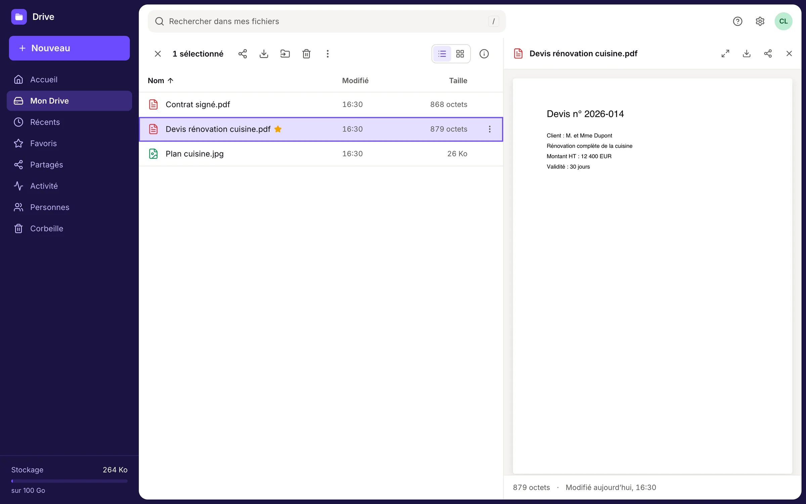
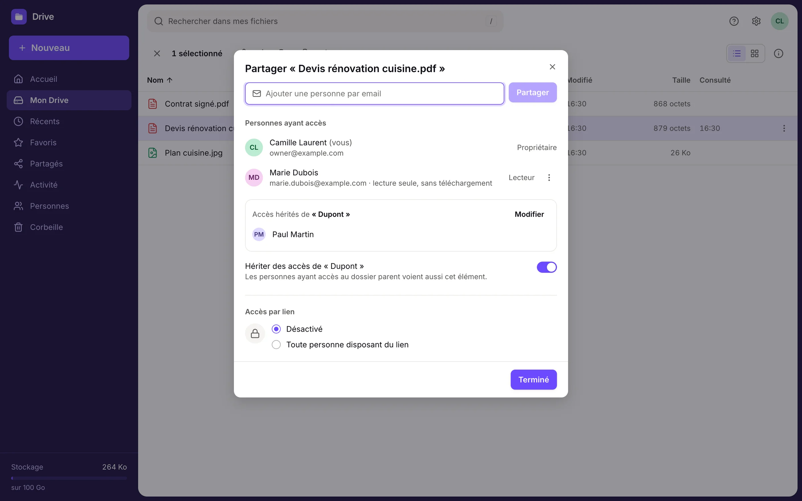
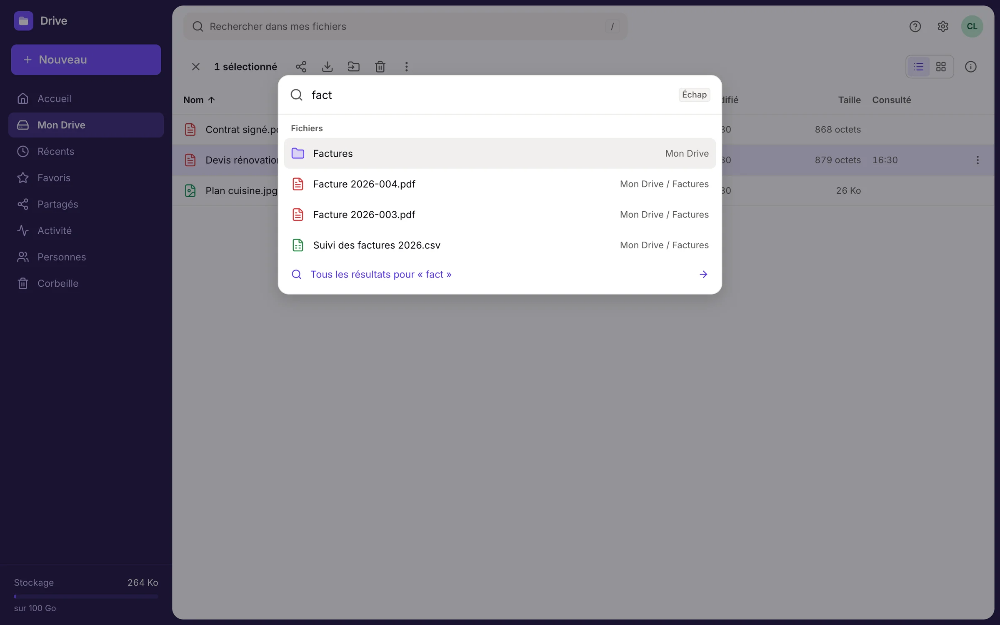
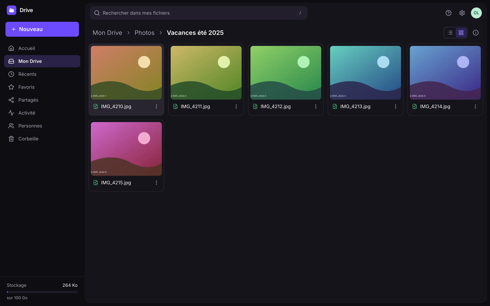
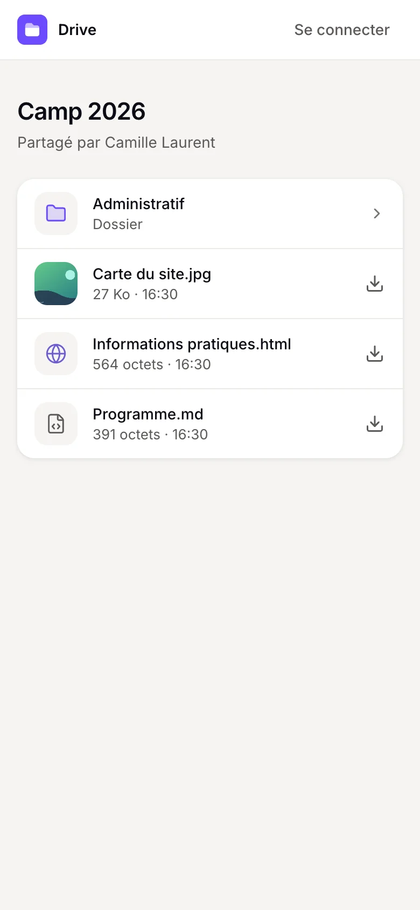

**English** · [Français](README.fr.md)

<div align="center">


# Drive

**Share your files, keep control. Decide exactly who sees what, and know who opened them.**

Self-hosted, one command to install it on any server with Docker. Free for yourself, ready for your team with Drive for Organizations.


</div>

## The idea

Drive separates the people who manage files from the people who read them. On your own, you are **the owner**. In an organization, **owners and members** manage files together, each with a role on the folders they work in. Everyone you share with is a **reader** and can never change anything: neither the interface nor the API allows it.

- **Organize** your files and folders as in a modern file manager: drag and drop, multiple selection, right click, keyboard shortcuts, command palette (⌘K).
- **Share** a file or a folder with a person (reader account), an invitation, a personal link or a public link. Downloads allowed or not, expiry, instant revocation.
- **Know who viewed** what and when: a readable activity log, honest about what it knows (a public link stays anonymous).
- **Publish HTML pages or whole websites** (uploaded as a ZIP) safely: they are displayed on an isolated origin, full screen if you like.
- **Find** a file by its name, its tags or its content: text from PDFs, Word documents, Excel spreadsheets and PowerPoint presentations. These documents also open in a preview, with nothing to install.
- **Go back in time**: turn on version history for a folder, and every file replaced in it keeps its earlier versions, to preview, name or restore without losing anything.
- **Let your AI assistant in**: Claude, Cursor or any MCP client can browse, search, read and, for you, organize your Drive after you sign in and allow it. It acts with your rights, never more, and you can disconnect it at any time ([guide](docs/mcp.md)).
- **Work as a team** with Drive for Organizations: each member gets a folder of their own and a role on every folder shared with them (view, edit or manage), while owners see everything and manage people and seats ([guide](docs/organizations.md)).
- **In English or French**, for you and for the people you share with.

<table>
<tr>
<td width="50%"></td>
<td width="50%"></td>
</tr>
<tr>
<td align="center"><sub>Quick preview without leaving the list</sub></td>
<td align="center"><sub>Sharing: people, inheritance, public link</sub></td>
</tr>
<tr>
<td width="50%"></td>
<td width="50%"></td>
</tr>
<tr>
<td align="center"><sub>Command palette (⌘K)</sub></td>
<td align="center"><sub>Dark mode, grid view with thumbnails</sub></td>
</tr>
</table>

<p align="center"><br><sub>What the person who receives a link sees</sub></p>

## Editions

| | Personal | Organizations |
|---|---|---|
| People who manage files | One owner | Owners and members, one seat each |
| Readers, links, activity, previews, versions, AI assistants | Included | Included |
| Roles per folder: view, edit, manage | No | Yes |
| Price | Free for noncommercial use | License key, see [COMMERCIAL.md](COMMERCIAL.md) |

Readers never take a seat. A license key is checked on your server, without any network call.

## Installation

You need a Linux server (VPS, Raspberry Pi 4 or newer, NAS, a machine at home) with 1 GB of free RAM. Docker is installed automatically if needed.

```bash
curl -fsSL https://raw.githubusercontent.com/Aqu1tain/drive/main/install.sh | bash
```

The script asks you two or three questions (your domain name, optional), generates every secret, starts Drive and gives you the address where you create your owner account.

- **With a domain** (recommended): point two names at your server, for example `drive.example.com` and `files.example.com`. HTTPS certificates are obtained and renewed automatically.
- **Without a domain**: Drive is served over HTTP on the IP address, which is fine for trying it out or for a local network.

The detailed guide, the non-interactive options and the manual configuration are in **[docs/install.md](docs/install.md)**.

### Installing with an AI assistant

The installation guide is written so that an agent (Claude Code, Codex, Cursor…) connected to your server can follow it. Just tell it:

> Install Drive on this server by following https://github.com/Aqu1tain/drive/blob/main/docs/install.md. My domain is drive.example.com.

Every step of the guide ends with a check command, so the agent knows whether it worked.

### Day to day

```bash
~/drive/install.sh update    # update
~/drive/install.sh backup    # back up the database, the files and the configuration
~/drive/install.sh logs      # follow the logs
~/drive/install.sh status    # service status
```

## Security, in short

- Authorization is centralized on the server: every request recomputes permissions, so a revocation takes effect immediately.
- No storage URL is ever exposed: everything goes through the application, which checks access.
- HTML and SVG never run on the application's origin. Web pages are served from a separate domain, in a sandbox (CSP `sandbox`), without cookies.
- Strict nonce-based CSP, origin-based CSRF protection, share tokens stored hashed and encrypted, passwords, passkeys and two-factor authentication (TOTP).
- A minimal activity log: IP addresses are truncated then hashed (or not recorded at all), with a configurable retention period. See [docs/privacy.md](docs/privacy.md).

Report a vulnerability: [SECURITY.md](SECURITY.md). Architecture choices: [docs/decisions.md](docs/decisions.md).

## Development

```bash
pnpm install
cp .env.example .env                        # then fill in NUXT_AUTH_SECRET
docker compose -f compose.dev.yaml up -d    # Postgres, MinIO, Mailpit
pnpm dev                                    # http://localhost:3000
pnpm seed                                   # demo content (optional)
```

| Command | Purpose |
|---|---|
| `pnpm test:unit` | Permission resolver, names, search, cryptography, document parsing |
| `pnpm test:integration` | API and database, security scenarios (dev server running) |
| `pnpm test:e2e` | Full journeys in a browser, axe accessibility audit |
| `pnpm typecheck` | TypeScript check |

Stack: Nuxt 4, Vue 3, TypeScript, PostgreSQL 17, Drizzle, Better Auth, Tailwind 4, Reka UI, S3 storage (MinIO by default) or local disk. Conventions and pointers for contributors: [AGENTS.md](AGENTS.md) and [docs/ux.md](docs/ux.md).

## License

Source-available under the [PolyForm Strict License 1.0.0](LICENSE): free to use for noncommercial purposes, without changing or redistributing it. Commercial use requires a paid license: see [COMMERCIAL.md](COMMERCIAL.md). Versions up to 1.4.1 were published under CC BY-NC-SA 4.0.
